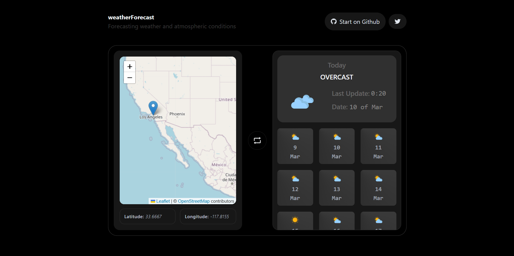

<p align="center">
  <a href="#" rel="noopener" target="_blank"></a>
</p>

<h1 align="center">WEATHER FORECAST</h1>

This app visualizes global weather conditions by selecting a location on a map. It provides real-time weather updates and forecasts for over 15 days.

<p align="center">
  <a href="#" rel="noopener" target="_blank"></a>
</p>

## Features

- Map interface to select any location in the world.
- Real-time updates of current weather conditions for the selected location.
- Weather forecast for over 15 days from today.
- Intuitive and user-friendly design for all users, regardless of their level of experience with weather apps.

## Installation

To install the project locally, follow these steps:

- Clone this repository on your local machine.
  ```sh
  git clone https://github.com/your-user/weather-forecast.git
  ```
- Install project dependencies:

  ```sh
  cd weather-forecast
  ```

  ```sh
  pnpm install
  ```

  or

  ```sh
  npm install
  ```

- Run to start the application.
  ```sh
  pnpm dev
  ```
  or
  ```sh
  npm run dev
  ```
- Open your browser and navigate to http://localhost:5173/ to view the application.

## Technologies Used

- React
- TypeScript
- Tailwindcss
- Zustand
- Vitejs

## Contributing

If you would like to contribute to this project, please open an issue or send a pull request. We are happy to review your contributions!
